# Ethereum smart contract 개발 환경 구축하기
> 24.01.30. Windows 개발환경 기준

## Prerequisites
1. __node(npm) 설치__
    > Binary 기준 (Installer도 무방)
    <br/>&nbsp;&nbsp;
    버전은 24.01.30.기준 LTS 최신 20.11.0 으로 진행
    - <code># Binary 파일 다운로드 후 압축해제</code>
        1. <code># 다운경로 : https://nodejs.org/dist/v20.11.0/node-v20.11.0-win-x64.zip</code>
    - <code># 환경변수 설정 (사용자환경변수 or 시스템환경변수)</code>
        > __Installer 설치 시 skip__
        1. <code>NODE_HOME = {압축해제 폴더경로}</code>
            <br/>&nbsp;&nbsp;
            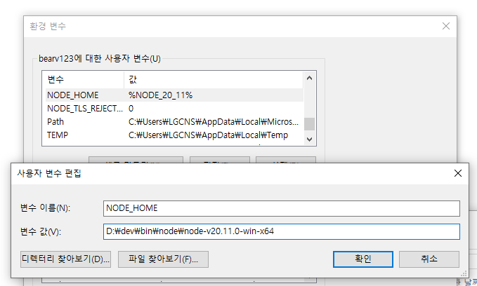
        <br/>&nbsp;&nbsp;
        1. <code>Path += %NODE_HOME%</code>
            <br/>&nbsp;&nbsp;
            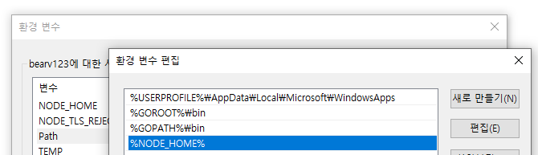
        <br/>&nbsp;&nbsp;
        1. <code>NODE_TLS_REJECT_UNAUTHORIZED = 0</code>
            <br/>&nbsp;&nbsp;
            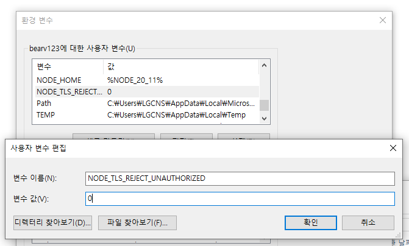
<br/>&nbsp;&nbsp;

1. __VSCode 설치__
    > Binary 기준 (Installer도 무방)
    <br/>&nbsp;&nbsp;
    버전은 24.01.30.기준 최신 1.85.2 로 진행
    - <code># Binary 파일 다운로드 후 압축해제</code>
        1. <code># 다운경로 : https://update.code.visualstudio.com/1.85.2/win32-x64-archive/stable</code>
    - <code># VSCode 실행 (압축해제 폴더\Code.exe)</code>
        <br/>&nbsp;&nbsp;
        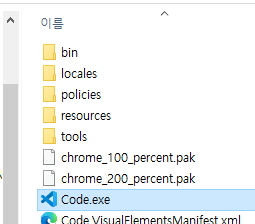
    <br/>&nbsp;&nbsp;
    - <code># 터미널(Ctrl + Shift + `)에서 node 설치여부 확인</code>
        1. node -v
        1. npm -v
        1. npx -v
            <br/>&nbsp;&nbsp;
            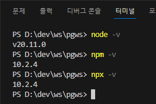
        <br/>&nbsp;&nbsp;
<br/>&nbsp;&nbsp;

## local node 세팅
1. __hardhat project__
    > local node 세팅 / smart contract compile & deploy
    - <code># 터미널(Ctrl + Shift + `)에서 실행</code>
        1. <code>mkdir hardhat</code>
        1. <code>cd hardhat</code>
        1. <code>npm install --save-dev hardhat</code>
        1. <code>npx hardhat init</code>
            <br/>&nbsp;&nbsp;
            - <code>어떤 언어 project 설정할지 (TypeScript)</code>
            <br/>&nbsp;&nbsp;
            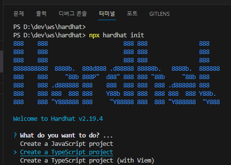
            <br/>&nbsp;&nbsp;
            - <code>project 설정(전부 default 설정)</code>
            <br/>&nbsp;&nbsp;
            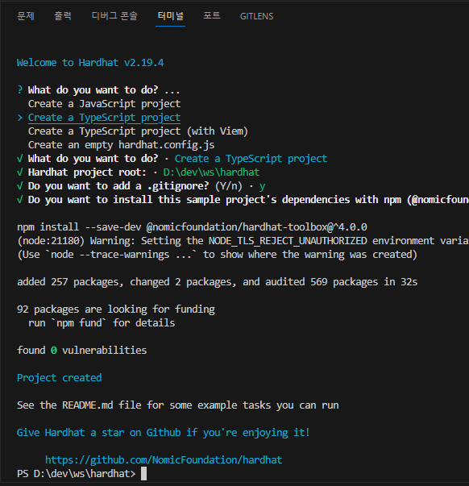
        <br/>&nbsp;&nbsp;
    ###### hardhat 기동
    - <code># 1번 터미널(Ctrl + Shift + `)에서 실행 - node 실행</code>
        1. <code>cd hardhat</code>
        1. <code>npx hardhat node --hostname 0.0.0.0 --port 8545</code>
            - <code></code>
            <br/>&nbsp;&nbsp;
            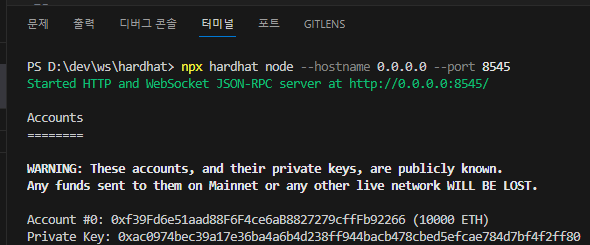
            <br/>&nbsp;&nbsp;
            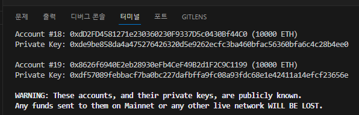
        <br/>&nbsp;&nbsp;
        1. <code># 종료방법은 (Ctrl + C 후 Y 엔터)</code>
    <br/>&nbsp;&nbsp;
    - <code># 2번 터미널(Ctrl + Shift + `)에서 실행 - </code>
        1. <code># default network 설정</code>
            - <code># [hardhat.config.ts](./props/files/hardhat.config.ts) 파일 수정 - defaultNetwork 내용 추가</code>
                <br/>&nbsp;&nbsp;
                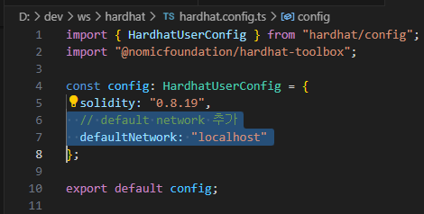
                <br/>&nbsp;&nbsp;
                ```typescript
                import { HardhatUserConfig } from "hardhat/config";
                import "@nomicfoundation/hardhat-toolbox";

                const config: HardhatUserConfig = {
                  solidity: "0.8.19",
                  // default network 추가
                  defaultNetwork: "localhost"
                };

                export default config;
                ```
            <br/>&nbsp;&nbsp;
        1. <code>cd hardhat</code>
        1. <code>npx hardhat run .\scripts\deploy.ts</code>
            <br/>&nbsp;&nbsp;
            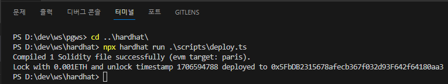
            <br/>&nbsp;&nbsp;
            - <code># node 실행했던 1번 터미널에선 아래와 같이 deploy 된 로그가 출력됨</code>
            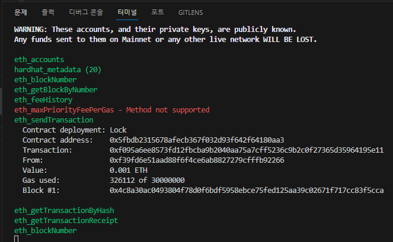
        <br/>&nbsp;&nbsp;
    <br/>&nbsp;&nbsp;
<br/>&nbsp;&nbsp;

1. __sample react project(front 화면)__
    > front sample page 설정
    - <code># 터미널(Ctrl + Shift + `)에서 실행</code>
        1. <code>npx create-react-app sample-ethers --template typescript</code>
            <br/>&nbsp;&nbsp;
            - <code>설치중...</code>
            <br/>&nbsp;&nbsp;
            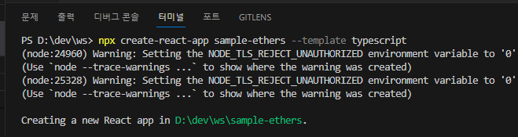
            <br/>&nbsp;&nbsp;
            - <code>설치완료...</code>
            <br/>&nbsp;&nbsp;
            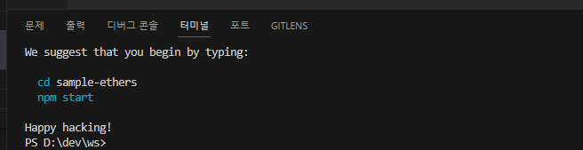
            <br/>&nbsp;&nbsp;
    - <code># 설치 완료 후 터미널에서</code>
        1. <code>cd sample-ethers</code>
        1. <code>npm start</code>
        1. <code># 로컬PC 브라우저(chrome 추천)에서 //http://localhost:3000 으로 접속</code>
            <br/>&nbsp;&nbsp;
            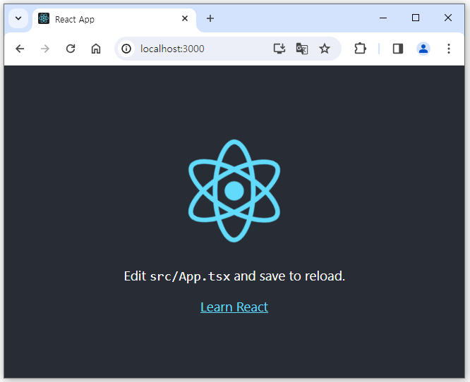
        <br/>&nbsp;&nbsp;
<br/>&nbsp;&nbsp;

1. __기본 테스트 환경 구성__
    - <code>[# hardhat 기동](#hardhat-기동)</code>
    - <code># sample-ethers에서 아래 파일들 수정&추가</code>
        > [sample-ethers\App.css](./props/code/App.css)
        <br/>
        [sample-ethers\App.tsx](./props/code/App.tsx)
        <br/>
        [sample-ethers\react-app-env.d.ts](./props/code/react-app-env.d.ts)
        <br/>
        [sample-ethers\components\address.tsx](./props/code/components\address.tsx)
        <br/>
        [sample-ethers\components\amount.tsx](./props/code/components\amount.tsx)
    - <code># sample-ethers 기동</code>
        1. <code>cd sample-ethers</code>
        1. <code># npm install은 최초 1회만(ethersjs 사용하기 위해)</code>
        1. <code>npm install ethers</code>
        1. <code>npm start</code>
        1. <code># 로컬PC 브라우저(chrome)에서 //http://localhost:3000 으로 접속</code>
            <br/>&nbsp;&nbsp;
            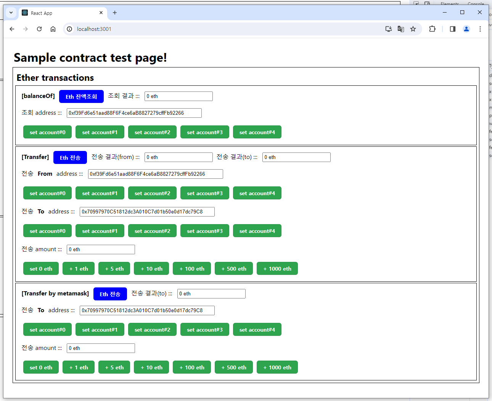
    <br/>&nbsp;&nbsp;
<br/>&nbsp;&nbsp;
