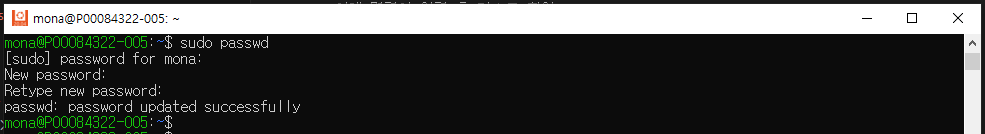
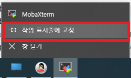
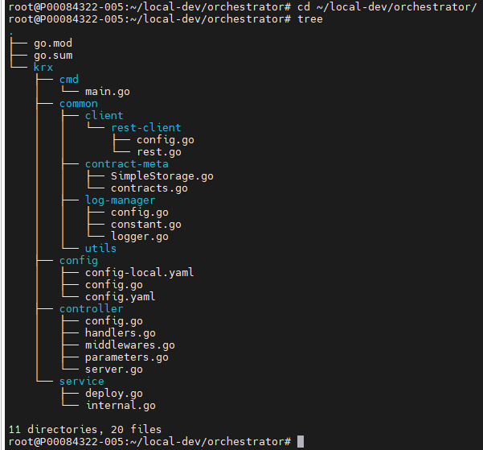

# KRX 로컬 개발환경 구성하기

## editor 환경 셋업

### 사용 tool 다운로드 및 설치

1. __WSL__
    - Windwo 기능 켜기
        ```powershell
        # [powershell]
        # win _ r 키 혹은 win 키 검색 appwiz.cpl
        # window 기능 중 Hyper-V, Linux용 Windows 하위 시스템 체크 설치 및 재부팅
        ```
        
        <br/>&nbsp;&nbsp;
        
        <br/>&nbsp;&nbsp;

    - 관리자 권한으로 powershell 실행
        
        <br/>&nbsp;&nbsp;

    - 아래 명령어 입력 후 리스트 확인
        ```powershell
        # [powershell]
        # 버전 확인
        wsl.exe --list --online
        wsl.exe --status
        ```
        
        <br/>&nbsp;&nbsp;

        ```powershell
        # [powershell]
        # list 확인이 안될 시 진행 - 긴시간(2~30분정도) 소요
        dism.exe /online /enable-feature /featurename:VirtualMachinePlatform /all /norestart
        ```
        
        <br/>&nbsp;&nbsp;

    - WSL 설치
        > 참고 : https://learn.microsoft.com/ko-kr/windows/wsl/install
        ```powershell
        # [powershell]
        wsl.exe --set-default-version 2

        # 특정 버전 설치
        wsl --install -d Ubuntu-20.04
        ## 버전 설치 시 오류가 나면 Window 기능 중 Hyper-V는 다시 체크 해제
        ## 체크 해제 후 재실행(위 wsl --install ... 멸령어) 시 동일한 오류가 난다면
        wsl --update
        ## 업데이트 후 재실행(wsl --install ...)
        ```
        
        <br/>&nbsp;&nbsp;

        ```powershell
        # [powershell]
        # 삭제 방법 (삭제 필요 시 // 필수 x)
        wsl --shutdown
        wsl --unregister Ubuntu-20.04
        
        # 설치 버전 확인
        wsl -l -v
        wsl --set-version Ubuntu-20.04 2
        ```
        
        <br/>&nbsp;&nbsp;

        ```powershell
        # 계정 설정
        ```
        
        <br/>&nbsp;&nbsp;

        ```shell
        # [wsl(ubuntu)]
        # root 계정 비밀번호 설정
        sudo passwd

        # systemctl 명령어 사용 설정
        sudo cat > /etc/wsl.conf <<EOL
        [boot]
        systemd=true
        EOL

        # ssh root 접속 설정
        sudo vi /etc/ssh/sshd_config
        # 34 라인 아래와 같이 수정
        sudo systemctl restart ssh
        # 오류가 나더라도 아래 MobaXterm 실행해서 접속 가능한지 확인
        ```
        
        <br/>&nbsp;&nbsp;
        
        <br/>&nbsp;&nbsp;

        ```powershell
        # [wsl(ubuntu)]
        # ssh restart
        sudo service ssh restart
        # 아래 오류시 (필수 x)
        sudo ssh-keygen -A
        ```
        
        <br/>&nbsp;&nbsp;

        ```powershell
        # [powershell]
        # wsl 재기동
        Ubuntu2004.exe config --default-user root
        sc stop LxssManager
        sc start LxssManager
        wsl.exe -t Ubuntu-20.04
        wsl.exe -d Ubuntu-20.04
        ```
        
        <br/>&nbsp;&nbsp;

1. __MobaXterm__
    > 다운 페이지 : https://mobaxterm.mobatek.net/download-home-edition.html
    <br/>&nbsp;&nbsp;
    > 다운 파일 : https://download.mobatek.net/2402024022512842/MobaXterm_Portable_v24.0.zip
    ```powershell
    # [window]
    # 다운 파일(.zip)을 압축 해제 후 MobaXterm_Personal_24.0.exe 실행
    # 최초 1회 네트워크 방화벽 해제
    # 편한 툴 실행을 위한 작업표시줄 고정
    ```
    
    <br/>&nbsp;&nbsp;
    
    <br/>&nbsp;&nbsp;

    ```shell
    # [monaXterm(ubuntu)]
    # session 설정
    # session 로그인 & OS 버전 확인
    cat /etc/*release*
    ```
    
    <br/>&nbsp;&nbsp;
    
    <br/>&nbsp;&nbsp;

1. __docker__
    ```shell
    # [monaXterm(ubuntu)]
    echo "check_certificate = off" >> ~/.wgetrc
    echo insecure >> ~/.curlrc
    sudo apt update
    sudo apt install -y apt-transport-https ca-certificates curl gnupg-agent software-properties-common net-tools tree unzip

    curl -fsSL https://download.docker.com/linux/ubuntu/gpg | sudo apt-key add -
    sudo add-apt-repository "deb [arch=amd64] https://download.docker.com/linux/ubuntu $(lsb_release -cs) stable"
    sudo apt-get update

    # 기존 설치버전 삭제
    for pkg in docker-ce docker-ce-cli containerd.io docker.io docker-buildx-plugin docker-compose-plugin docker-doc docker-compose docker-compose-v2 podman-docker containerd runc; do sudo apt-get remove -y $pkg; done

    # specific version
    ### 버전 리스트 확인
    apt-cache madison docker.io | awk '{ print $3 }'

    ### 버전 확인 설치
    VERSION_STRING=24.0.5-0ubuntu1~20.04.1
    # sudo apt-get install -y docker-ce=${VERSION_STRING} docker-ce-cli=${VERSION_STRING} containerd.io docker-buildx-plugin docker-compose-plugin
    sudo apt-get install -y docker.io=${VERSION_STRING}

    # docker 기동
    sudo service docker start
    sudo systemctl enable docker
    sudo service docker status

    # 설치 확인
    docker version

    # docker-compose
    COMPOSE_VERSION_V1=1.29.2
    COMPOSE_VERSION_V2=v2.24.0
    sudo curl -L "https://github.com/docker/compose/releases/download/${COMPOSE_VERSION_V1}/docker-compose-$(uname -s)-$(uname -m)" -o /usr/local/bin/docker-compose_v1
    sudo curl -L "https://github.com/docker/compose/releases/download/${COMPOSE_VERSION_V2}/docker-compose-$(uname -s)-$(uname -m)" -o /usr/local/bin/docker-compose_v2
    sudo chmod +x /usr/local/bin/docker-compose_v1 /usr/local/bin/docker-compose_v2
    sudo ln -sf /usr/local/bin/docker-compose_v2 /usr/local/bin/docker-compose

    # 설치 확인
    docker-compose version
    ```

1. __OpenJDK__
    > 다운 페이지 : https://jdk.java.net/archive/
    ```shell
    # [monaXterm(ubuntu)]
    mkdir -p /usr/local/tools/ && cd $_
    wget https://download.java.net/java/GA/jdk17.0.2/dfd4a8d0985749f896bed50d7138ee7f/8/GPL/openjdk-17.0.2_linux-x64_bin.tar.gz
    tar zxf openjdk-17.0.2_linux-x64_bin.tar.gz
    sudo ln -sf /usr/local/tools/jdk-17.0.2/bin/* /usr/local/bin/

    # 설치 확인
    java --version
    ```

1. __Go__
    > 다운 페이지 : https://go.dev/dl/
    ```shell
    # [monaXterm(ubuntu)]
    mkdir -p /usr/local/tools/ && cd $_
    wget https://go.dev/dl/go1.21.2.linux-amd64.tar.gz
    tar zxf go1.21.2.linux-amd64.tar.gz
    sudo ln -sf /usr/local/tools/go/bin/* /usr/local/bin/

    # 설치 확인
    go version
    ```

1. __Besu network__
    1. Besu command 설치
        > 다운 페이지 : https://hyperledger.jfrog.io/artifactory/besu-binaries/besu
        ```shell
        # [monaXterm(ubuntu)]
        mkdir -p /usr/local/tools/ && cd $_
        BESU_VER=23.10.2
        wget https://hyperledger.jfrog.io/artifactory/besu-binaries/besu/${BESU_VER}/besu-${BESU_VER}.tar.gz
        tar zxf besu-${BESU_VER}.tar.gz
        sudo ln -sf /usr/local/tools/besu-${BESU_VER}/bin/* /usr/local/bin/

        # 설치 확인
        besu --version
        ```

    1. Besu network 실행
        ```shell
        # [monaXterm(ubuntu)]
        # workspace 이동
        mkdir -p ~/local-dev && cd $_

        # config file 생성
        mkdir -p ./networkfiles
        cat > ./networkfiles/QBFTconfig.json <<EOL
        {
            "genesis" : {
                "config" : {
                    "chainId" : 1337,
                    "grayGlacierBlock": 0,
                    "zeroBaseFee": true,
                    "qbft": {
                    "epochlength": 30000,
                    "blockperiodseconds": 3,
                    "requesttimeoutseconds": 6
                    }
                },
                "nonce" : "0x0",
                "timestamp" : "0x58ee40ba",
                "gasLimit" : "0x1fffffffffffff",
                "difficulty" : "0x1",
                "number": "0x0",
                "gasUsed": "0x0",
                "contractSizeLimit": 2147483647,
                "mixHash" : "0x63746963616c2062797a616e74696e65206661756c7420746f6c6572616e6365",
                "coinbase" : "0x0000000000000000000000000000000000000000",
                "alloc" : {
                    "0xfe3b557e8fb62b89f4916b721be55ceb828dbd73" : {
                    "privateKey" : "0x8f2a55949038a9610f50fb23b5883af3b4ecb3c3bb792cbcefbd1542c692be63",
                    "comment" : "private key and this comment are ignored.  In a real chain, the private key should NOT be stored",
                    "balance" : "90000000000000000000000"
                    },
                    "0x627306090abaB3A6e1400e9345bC60c78a8BEf57" : {
                    "privateKey" : "0xc87509a1c067bbde78beb793e6fa76530b6382a4c0241e5e4a9ec0a0f44dc0d3",
                    "comment" : "private key and this comment are ignored.  In a real chain, the private key should NOT be stored",
                    "balance" : "0x130EE8E7179044400000"
                    },
                    "0xf17f52151EbEF6C7334FAD080c5704D77216b732" : {
                    "privateKey" : "0xae6ae8e5ccbfb04590405997ee2d52d2b330726137b875053c36d94e974d162f",
                    "comment" : "private key and this comment are ignored.  In a real chain, the private key should NOT be stored",
                    "balance" : "90000000000000000000000"
                    }
                }
                },
                "blockchain" : {
                "nodes" : {
                    "generate" : true,
                    "count" : 1
                }
            }
        }
        EOL
        ```
        [./networkfiles/QBFTconfig.json](./props/files/QBFTconfig.json)
        <br/>&nbsp;&nbsp;

        ```shell
        # [monaXterm(ubuntu)]
        # genesis, node key쌍 생성
        ## https://besu.hyperledger.org/private-networks/reference/cli/subcommands#generate-blockchain-config
        # besu operator generate-blockchain-config --config-file=<FILE> --to=<DIRECTORY> [--genesis-file-name=<FILE>] [--private-key-file-name=<FILE>] [--public-key-file-name=<FILE>]
        besu operator generate-blockchain-config --config-file=./networkfiles/QBFTconfig.json --to=./configs --genesis-file-name=genesis.json

        # 생성 파일 확인
        tree configs
        ```
        
        <br/>&nbsp;&nbsp;

        ```shell
        # [monaXterm(ubuntu)]
        # docker-compose 파일 생성
        cat > ./docker-compose.yaml <<EOL
        version: '2'

        services:

          besu-node:
            container_name: besu-node
            image: hyperledger/besu:23.10.2
            ports:
            - 8545:8545
            - 8546:8546
            - 8547:8547
            - 30303:30303/tcp
            - 30303:30303/udp
            environment:
            - OTEL_RESOURCE_ATTRIBUTES=service.name=besu-node,service.version=latest
            - BESU_P2P_HOST=127.0.0.1 # 127.0.0.1
            - BESU_P2P_PORT=30303 # 30303
            - BESU_RPC_HTTP_API=EEA,WEB3,ETH,NET,TRACE,DEBUG,ADMIN,TXPOOL,PRIV,PERM,QBFT
            - BESU_RPC_WS_API=EEA,WEB3,ETH,NET,TRACE,DEBUG,ADMIN,TXPOOL,PRIV,PERM,QBFT
            - BESU_GENESIS_FILE=/config/genesis.json
            - BESU_DATA_PATH=/opt/besu/data
            - BESU_NODE_PRIVATE_KEY_FILE=/opt/besu/keys/key.priv
            - BESU_HOST_ALLOWLIST=*
            - BESU_MIN_GAS_PRICE=0
            - BESU_DISCOVERY_ENABLED=true
            ### !! modify !! ###
            - BESU_BOOTNODES=enode://<configs/keys/0x.../key.pub내용(0x제외)>@127.0.0.1:30303
            ## append
            - BESU_LOGGING=DEBUG
            ### rpc-http
            - BESU_RPC_HTTP_ENABLED=true
            - BESU_RPC_HTTP_HOST=0.0.0.0
            - BESU_RPC_HTTP_PORT=8545
            - BESU_RPC_HTTP_CORS_ORIGINS=*
            ### rpc-ws
            - BESU_RPC_WS_ENABLED=true
            - BESU_RPC_WS_HOST=0.0.0.0
            - BESU_RPC_WS_PORT=8546
            ### graphql-http
            - BESU_GRAPHQL_HTTP_ENABLED=true
            - BESU_GRAPHQL_HTTP_HOST=0.0.0.0
            - BESU_GRAPHQL_HTTP_PORT=8547
            - BESU_GRAPHQL_HTTP_CORS_ORIGINS=*
            labels:
            - "consensus=besu"
            volumes:
            - ./configs/:/config
            ### !! modify !! ###
            - ./configs/keys/<하위 node address>:/opt/besu/keys
        EOL
        ```
        [./docker-compose.yaml](./props/files/docker-compose.yaml)
        <br/>&nbsp;&nbsp;

        ```shell
        # [monaXterm(ubuntu)]
        ### !! modify !! ###
        # 2군데 수정
        ## 1. - BESU_BOOTNODES=enode://<configs/keys/0x.../key.pub내용(0x제외)>@127.0.0.1:30303
        ### >> - BESU_BOOTNODES=enode://241ea5ff709b128b47573e7b523479df1da3ad47adb773e74c2a6c4e8d472832c20986b5082ddf0aa10188c2280e251bfeb012669fcea65bde7c3b9101bee493@127.0.0.1:30303

        ## 2. - ./configs/keys/<하위 node address>:/opt/besu/keys (:빼먹지 않도록 주의)
        ### >> - ./configs/keys/0xd2704912738a42e52430ca46a6cae5c2cf4eb32c:/opt/besu/keys

        # 수정 후 기동
        docker-compose up
        ```

1. __Orchestrator__
    1. Orchestrator 설치
        ```shell
        # [monaXterm(ubuntu)]
        # 새로운 창에서 제공받은 orchestrator 폴더로 이동 후 구조 확인
        cd ~/local-dev/orchestrator/
        tree
        ```
        
        <br/>&nbsp;&nbsp;

        ```shell
        # [monaXterm(ubuntu)]
        # 프로젝트 빌드
        cd ~/local-dev/orchestrator/
        go mod tidy && go mod vendor

        ## 아래와 같은 certificate 오류가 날 시
        cd /usr/share/ca-certificates/extra
        echo QUIT | openssl s_client -connect proxy.golang.org:443 | tee proxy.golang.org_log
        openssl x509 -inform PEM -in proxy.golang.org_log -text -out proxy.golang.org.crt
        openssl x509 -inform PEM -text -in proxy.golang.org.crt
        mkdir -p /etc/pki/tls/certs && cp proxy.golang.org.crt /etc/pki/tls/certs/ca-bundle.crt
        ```
        
        <br/>&nbsp;&nbsp;

    1. VsCode로 관리
        ```powershell
        # Vscode 설치 후 실행
        ## wsl extension 설치
        ## wsl 터미널 접속
        ```
        
        <br/>&nbsp;&nbsp;
        
        <br/>&nbsp;&nbsp;

        ```shell
        # [vsCode(ubuntu)]
        # workspace 폴더 열기

        ## orchestrator/krx/config/config.yaml 확인
        ### profile이 local 이라면 config-local.yaml 추가 확인
        #### 3가지 설정 확인
        server.port
        blockchain.endpoint.url
        blockchain.endpoint.http.port

        # orchestrator/krx/common/contract-meta/contracts.go
        ## api에서 사용할 contract name 에 abi, bytecode 값 추가하기

        # orchestrator 실행
        ## VsCode에서 터미널 실행 ( Ctrl + ` )
        cd ~/local-dev/orchestrator
        go run krx/cmd/main.go

        # 2가지 api 존재
        POST http://localhost:8000/api/v1/general/contract/call/sync
        {
            "contractName": "{{contractName}}",
            "contractSender": "{{sender}}",
            "contractSenderKey": "{{sender}}",
            "contractAddress": "{{contractAddress}}",
            "contractFunctionName": "set",
            "contractParams": "{\"x\":\"135\"}"
        }

        POST http://localhost:8000/api/v1/general/contract/call/read
        {
            "contractName": "{{contractName}}",
            "contractSender": "{{sender}}",
            "contractAddress": "{{contractAddress}}",
            "contractFunctionName": "get",
            "contractParams": "{}"
        }

        ## 현재 배포 및 metadata 업데이트 기능이 없습니다ㅠ
        ### 배포는 hardhat 기능 사용할 수 있게 ts 파일 첨부합니다.
        ## 얼른 추가하겠습니다.
        ```
        [/hardhat/scripts/deploy-simple.ts](./props/files/deploy-simple.ts)
        <br/>&nbsp;&nbsp;
        [/vscode/rest](./props/files/deploy-simple.ts)
        <br/>&nbsp;&nbsp;

## 테스트
