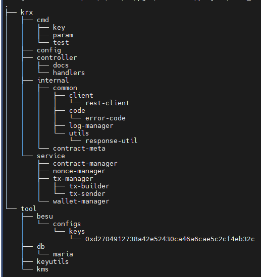
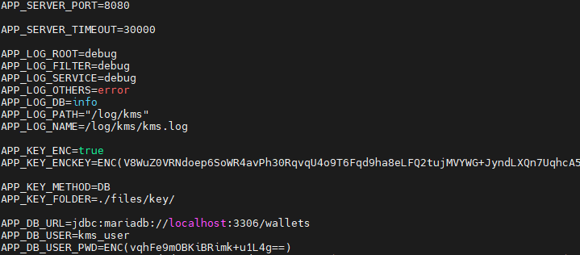
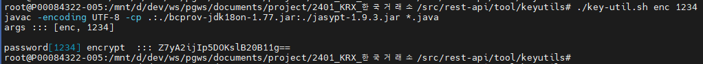
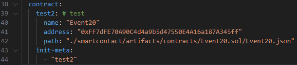

# Orchestrator ( Blockchain API Service ) 구성

- __Prerequisites(Window)__
    1. WSL 설치
        > WSL 설치는 되어있다 가정
    1. VSCode 설치 (Portable)
        > https://update.code.visualstudio.com/1.85.2/win32-x64-archive/stable
        ```powershell
        # 설치경로(압축해제) D:\dev\tools\editor\VSCode-win32-x64-1.85.2 라 가정
        ```

    1. VSCode extesion 설치
        - go 설치
          
          <br/>&nbsp;&nbsp;

- __Prerequisites(WSL)__
    1. Golang 설치
        > 다운 페이지 : https://go.dev/dl/
        ```shell
        # [monaXterm(ubuntu)]
        mkdir -p /usr/local/tools/ && cd $_
        wget https://go.dev/dl/go1.21.2.linux-amd64.tar.gz
        tar zxf go1.21.2.linux-amd64.tar.gz
        sudo ln -sf /usr/local/tools/go/bin/* /usr/local/bin/

        # 환경변수 추가
        echo -e '\n# go environment' >> ~/.bash_profile
        echo 'export GOROOT="/usr/local/tools/go"' >> ~/.bash_profile
        echo 'export GOPATH="${HOME}/gopath/"' >> ~/.bash_profile
        echo 'export PATH="${GOROOT}/bin:${GOPATH}/bin:${PATH}"' >> ~/.bash_profile
        source ~/.bash_profile

        # 설치 확인
        go version
        ```
        <br/>&nbsp;&nbsp;

    1. OpenJDK 설치
        > 다운 페이지 : https://jdk.java.net/archive/
        ```shell
        # [monaXterm(ubuntu)]
        mkdir -p /usr/local/tools/ && cd $_
        wget https://download.java.net/java/GA/jdk17.0.2/dfd4a8d0985749f896bed50d7138ee7f/8/GPL/openjdk-17.0.2_linux-x64_bin.tar.gz
        tar zxf openjdk-17.0.2_linux-x64_bin.tar.gz
        sudo ln -sf /usr/local/tools/jdk-17.0.2/bin/* /usr/local/bin/
        
        # 환경변수 추가
        echo -e '\n# java environment' >> ~/.bash_profile
        echo 'export JAVA_HOME="/usr/local/tools/jdk-17.0.2"' >> ~/.bash_profile
        echo 'export CLASSPATH=".:${JAVA_HOME}/lib"' >> ~/.bash_profile
        echo 'export PATH="${JAVA_HOME}/bin:${PATH}"' >> ~/.bash_profile
        source ~/.bash_profile

        # 설치 확인
        java --version
        ```
        <br/>&nbsp;&nbsp;

## Orchestrator 개발
    > 본 가이드에서는 필요 S/W(혹은 commond)(docker, docker-compose, s)
    > 또, swagger를 설정(function의 주석) & build하고 사용하는 방법에 대해서는 포함하지 않는다.
    > 다만, krx/controller/swag_init.sh 로 build하는 command 까지는 작성해두었다.
- 제공받은 orchestrator.zip을 압축해제하여 원하는 workspace(wsl내부이던, windowPC이던)를 설정해둔다.
```shell
# orchestrator 폴더 구조
```

<br/>&nbsp;&nbsp;

### kms 기동
    >  압축해제한 orchestrator.zip에는 kms_db, kms를 실행을 포함한다.

1. kms_db(mariadb) 기동
    ```shell
    # 사용자 계정/비밀번호/DB명의 변경이 필요하면 docker-compose.yaml 파일을 수정한다.
    cd tool/db/
    docker-compose up -d
    ```
    <br/>&nbsp;&nbsp;

1. kms 기동
    1. kms 환경변수 설정
        ```shell
        # [wsl]
        # tool/kms/.env 파일 확인
        # 아래 내용 중 APP_SERVER_PORT 와 APP_KEY_ENV, APP_DB_ 로 시작하는 부분을 신경써서 수정한다.
        cat tool/kms/.env
        ```
        
        <br/>&nbsp;&nbsp;

        ```shell
        # APP_DB_USER_PWD 의 경우 1234 와 같이 암호화되지 않은 값으로 작성해도 무방하다.
        # 혹 암호화가 필요한 경우 tool/keyutils/key-util.sh 을 참고한다.
        ./key-util.sh enc <암호화 할 password>
        ```
        
        <br/>&nbsp;&nbsp;

    1. kms 실행
        ```shell
        # kms 실행
        - cd tool/kms/
        - ./kms.sh
        ```
        <br/>&nbsp;&nbsp;

### besu network 기동
1. besu 기동
    ```shell
    cd tool/besu
    docker-compose up -d
    ```
    <br/>&nbsp;&nbsp;

### orchestrator 기동
1. orchestrator 환경변수 설정
    ```shell
    # 환경변수 확인
    # 파일명 : krx/config/config-local.yaml
    # 크게 수정해야할 환경변수이다.
    # server.port
    # kms.endpoint 내 url, port, org (kms 서버와 통신할 때 필요한 설정)
    # blockchain.endpoint 내 url, http.port (besu 노드와 통신할 때 필요한 설정)
    # blockchain.contract 내 init-meta, 해당 설정의 name, address, path (contract api 개발 시 사용)
    ```
    <br/>&nbsp;&nbsp;

1. orchestrator 빌드
    ```shell
    go build -o local-orche krx/cmd/main.go
    # 빌드 완료 후 실행
    ./local-orche
    ```
    <br/>&nbsp;&nbsp;

### orchestrator 개발 가이드
    > 본 가이드에서는 besu-network 가 기동되고, 원하는 contract를 배포했다고 가정한다.
    <br/>;
    > 배포 후 compile 된 json파일과, contract address를 알고 있다고 가정한다.

1. 배포 contract 환경변수 설정
    ```shell
    # krc/config/config-local.yaml 내 blockchain.contract 내 내용을 추가한다.
    # 아래의 예시는 erc20 토큰(약간의 수정) contract를 test2 라는 키워드로 배포한 뒤 Meta에서 사용할 이름(Event20)과 compiled file 경로, contract address를 입력한 모습이다.
    ```
    
    <br/>&nbsp;&nbsp;

1. api 개발
    1. krx/controller/hander 경로에 api 개발할 파일 생성 (index.go 복사/참고)

    1. IndexHandler 명칭을 원하는 Handler 이름으로 전부 변경
        - 주의사항으로는 대문자로 시작해야함.

    1. Transaction이면 Trnsfer 함수를 query면 BalanceOf 함수를 참고하여 API 함수 수정
        - API 함수 내 params 변수에는 interface{}(java의 Object 개념)라는 타입을 받을 순 있지만 string 형태로만 넣어야 함

    1. AppendPrefix 함수 내에 원하는 uri로 작성
        - uri 작성시 :이 붙은 uri의 경우 API 함수내에서 변수처럼 받아 사용 가능

    1. krx/config/config-local.yaml 39~42라인 처럼 배포한 contract 정보 추가하기
        - name의 경우 마음대로, address는 배포 시 return 받은 address, path는 orchestrator 서버 내 compile(json) 파일 경로
        - 추가한 키워드(Event20이 아닌 test2)를 init-meta 아래에 추가하기

    1. krx/controller/main.go 113라인 contractInfos = append(contractInfos, c.ContractInfo("test2")) 와 같이 config init-meta에 추가한 명칭 추가

    1. krx/controller/server.go 44라인 server.Get 위에 작성했던 Handler 아래와 같이 추가하기
        ```go
        indexHandler := handlers.NewIndexHandlerUrl(urls.KmsEndpoint, urls.NodeEndpoint, org, contract, contractInfos[0])
        indexHandler.AppendPrefix(v1, "/index")
        ```
    1. 다시 빌드 후 실행

<br/>&nbsp;&nbsp;